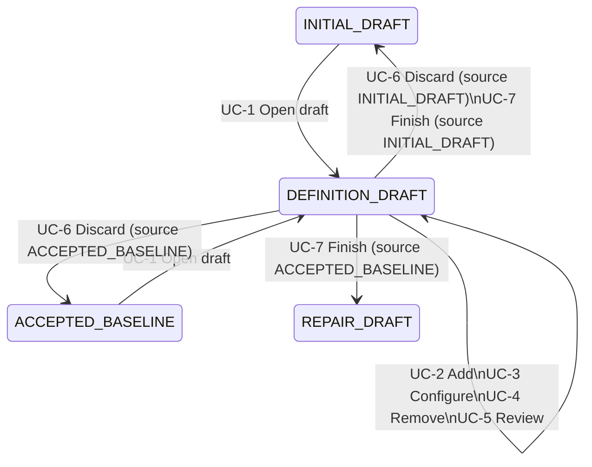

# School Definition Authoring

## Feature summary

School Definition Authoring lets the school timetable administrator maintain the school's cohorts, teachers, and rooms
from the timetable workspace, without editing School Kernel JSON. The administrator opens a durable definition draft,
adds or configures resources through form controls, including availability, qualifications, capacity, capabilities,
cohort day-shape limits, curators, and home rooms, and removes resources that nothing depends on any more.

Every save runs immediate workspace checks and persists the draft, even when it is invalid, so multi-step edits
can span several sessions. Issues appear next to the resource and attribute that caused them, including issues that
show up in lessons because of a resource edit. A draft can be finished only when School Kernel accepts the complete
definition. Before a baseline exists, finishing replaces the initial definition used for planning. After a baseline
exists, finishing opens a repair draft seeded with the complete successor definition, and the accepted timetable stays
current until a repair proposal is explicitly accepted.

## Scope and resolved decisions

### In scope

- A durable `DEFINITION_DRAFT` workspace state opened from `INITIAL_DRAFT` or `ACCEPTED_BASELINE`.
- Adding, configuring, reverting, and removing cohorts, teachers, and rooms.
- Editing every attribute listed in [Editable attributes](#editable-attributes) that the draft's catalog version
  supports.
- Period-set attributes edited on the school's declared period grid.
- Workspace-side checks on every save and authoritative School Kernel verification before finishing.
- A change summary against the source definition.
- Discarding the draft and finishing it into the initial draft or a repair draft.

### Resolved decisions

1. **Pre- and post-baseline authoring:** A definition draft can be opened from `INITIAL_DRAFT` or `ACCEPTED_BASELINE`.
   Authoring never mutates an accepted definition, accepted result, or accepted assignment.
2. **Successor lineage:** A draft opened from `ACCEPTED_BASELINE` is a complete successor definition whose
   `basedOnRevision` equals the accepted result's `inputRevision`. It becomes current only through the existing repair
   workflow: repair planning, a `FEASIBLE` proposal, and explicit acceptance.
3. **Blocked deletion:** A resource that any other part of the definition references cannot be removed. The workspace
   lists every dependent from [Removal dependents](#removal-dependents). Nothing is removed or rewritten implicitly.
4. **Persist invalid, gate on finish:** Saves are accepted when the draft is incomplete or invalid, as long as the
   request itself is well-formed. Finishing requires zero blocking workspace issues and a successful School Kernel
   verification of the exact complete definition.
5. **Immutable identifiers:** A resource's ID is chosen when the resource is added and never changes. Display names
   and every other attribute remain editable.
6. **Fixed catalog version:** A draft opened from `INITIAL_DRAFT` keeps that definition's catalog version. A draft opened
   from `ACCEPTED_BASELINE` uses the catalog version the repair workflow produces, the greater of `8` and the accepted
   version. Attributes the draft's catalog does not support are shown as unavailable, together with the catalog version
   that introduces them. They are never written.
7. **Preserved omission:** An attribute that is cleared is omitted, not written as its default. A period set that
   covers every declared period is stored as an omitted `availablePeriodIds`.
8. **Single draft:** While `DEFINITION_DRAFT` is active, planning runs, repair drafts, manual drafts, imports, and
   workspace clearing are refused.

## Actors and domain terms

### Actors

- **School timetable administrator:** The primary actor, who opens, edits, reviews, discards, and finishes definition
  drafts.
- **Local durable storage:** Supporting system that persists the workspace aggregate, including the definition draft.
- **School Kernel verifier:** Supporting system that authoritatively validates the complete draft definition before it
  can be finished.

### Domain terms

- **Resource:** A cohort, teacher, or room in the school definition.
- **Class (Cohort):** An indivisible group of students sharing one timetable. Its attributes include size,
  availability, day-shape limits, curator, and home room.
- **Source definition:** The definition from which the draft was opened: the initial draft definition or the accepted
  baseline definition. It is never modified by the draft.
- **Definition draft (`DEFINITION_DRAFT`):** A durable workspace state holding the complete working definition, its
  source state, its source definition revision, and its current issues.
- **Issue:** A reported problem with the draft. It is either *blocking* (the draft cannot be finished) or *advisory*
  (it informs the administrator but does not block finishing).
- **Dependent:** Any lesson, cohort, or room-assignment rule that references a resource by ID.
- **Period grid:** The school's declared periods arranged by weekday and order, with reserved periods marked.

## Use-case map

| Use case ID | Actor goal | Primary actor | Relations |
| --- | --- | --- | --- |
| UC-1 | Open a definition draft | School timetable administrator | None |
| UC-2 | Add a resource | School timetable administrator | Requires UC-1 |
| UC-3 | Configure a resource and its constraints (primary) | School timetable administrator | Requires UC-1 |
| UC-4 | Remove a resource | School timetable administrator | Requires UC-1 |
| UC-5 | Review draft changes and issues | School timetable administrator | Requires UC-1 |
| UC-6 | Discard the definition draft | School timetable administrator | Requires UC-1 |
| UC-7 | Finish the definition draft | School timetable administrator | Requires UC-1; Includes UC-5 at step 1 |

## State models

Allowed transitions:

- `INITIAL_DRAFT` -> `DEFINITION_DRAFT` via UC-1.
- `ACCEPTED_BASELINE` -> `DEFINITION_DRAFT` via UC-1.
- `DEFINITION_DRAFT` -> `DEFINITION_DRAFT` via UC-2, UC-3, UC-4, and UC-5.
- `DEFINITION_DRAFT` -> source state via UC-6.
- `DEFINITION_DRAFT` -> `INITIAL_DRAFT` via UC-7 when the source is `INITIAL_DRAFT`. The initial definition is replaced.
- `DEFINITION_DRAFT` -> `REPAIR_DRAFT` via UC-7 when the source is `ACCEPTED_BASELINE`. The accepted baseline is unchanged.

Every other transition into or out of `DEFINITION_DRAFT` is refused without side effects. Application restart restores
`DEFINITION_DRAFT` with its content and issues and never finishes or discards it.

### Definition lineage

A draft opened from `INITIAL_DRAFT` contains no `basedOnRevision`. A draft opened from `ACCEPTED_BASELINE` has
`basedOnRevision` equal to the accepted result's `inputRevision`. Because the draft blocks every other transition,
its source cannot change while it is open. The workspace never rebases a draft.

---

## Detailed use cases

## UC-1 - Open a definition draft

- Goal: Begin authoring the school's resources from the current definition.
- Primary actor: School timetable administrator
- Supporting actors: Local durable storage
- Trigger: The administrator chooses to edit school resources.
- Preconditions: The workspace is in `INITIAL_DRAFT` or `ACCEPTED_BASELINE`.
- Relations:
  - Requires: none
  - Includes: none
  - Extends: none

### Main success scenario

1. The administrator chooses to edit school resources.
2. The workspace copies the source definition into a new draft, records the source state and source definition
   revision, sets `basedOnRevision` and the catalog version according to the resolved decisions, and computes the
   initial issues.
3. The workspace durably saves the draft and enters `DEFINITION_DRAFT`.
4. The workspace shows the resource editor listing cohorts, teachers, and rooms by display name, states the source
   (initial draft or accepted timetable) and what finishing will do, and shows the current issue count.

### Extensions

- 1a. If the workspace is in any other state, including an active run, proposal, repair draft, or manual draft, the
  workspace refuses the request, names the state that must be resolved first, and ends.
- 1b. If the workspace is `EMPTY`, the workspace explains that a school definition with periods and subjects must be
  imported before its resources can be authored, and ends.
- 3a. If durable storage fails, the workspace reports that no draft was created, remains in the source state, and ends.

### Guarantees

- G1. Source immutability: the source definition, and for an accepted source the accepted result and assignments,
  remain byte-identical.
- G2. Initial parity: apart from `basedOnRevision` and the catalog version, the new draft's resources equal the source
  definition's resources.

### Postconditions

- Success: The workspace is in `DEFINITION_DRAFT` with a durable draft ready for editing.
- Minimal guarantee: The workspace remains in its source state without mutation if the draft cannot be opened.

---

## UC-2 - Add a resource

- Goal: Introduce a new cohort, teacher, or room into the draft definition.
- Primary actor: School timetable administrator
- Supporting actors: Local durable storage
- Trigger: The administrator chooses to add a cohort, teacher, or room.
- Preconditions: The workspace is in `DEFINITION_DRAFT`.
- Relations:
  - Requires: UC-1
  - Includes: none
  - Extends: none

### Main success scenario

1. The administrator chooses the resource type to add.
2. The workspace presents a creation form with the resource's required attributes from
   [Editable attributes](#editable-attributes) and a suggested ID derived from the display name. It explains that the
   ID cannot be changed later.
3. The administrator enters the display name, accepts or edits the ID, and fills in the required attributes.
4. The workspace checks that the ID matches the contract identifier pattern and is unique within that resource type.
5. The workspace adds the resource with only the entered attributes, leaving optional attributes omitted, recomputes
   issues, and durably saves the draft.
6. The workspace opens the new resource in the configuration view (UC-3), marked as added.

### Extensions

- 4a. If the ID is malformed or already used by a resource of that type in the draft, the workspace identifies the
  problem at the ID field, adds nothing, and resumes at step 3.
- 4b. If the ID matches a resource removed earlier in this draft that exists in the source definition, the workspace
  offers to restore the removed resource instead (UC-3 revert), and resumes at step 3 if the administrator declines.
- 5a. If durable storage fails, the workspace reports that the resource was not saved, keeps the form values for
  retry, leaves the stored draft unchanged, and ends.

### Guarantees

- G1. An added resource has no implicit constraints: every optional attribute is omitted until explicitly set.
- G2. Adding a resource never creates, modifies, or reassigns lessons.

### Postconditions

- Success: The draft contains the new resource and is persisted.
- Minimal guarantee: The stored draft is unchanged if the resource cannot be added.

---

## UC-3 - Configure a resource and its constraints (primary)

- Goal: Set or change the attributes and constraints of an existing or newly added cohort, teacher, or room.
- Primary actor: School timetable administrator
- Supporting actors: Local durable storage
- Trigger: The administrator selects a resource in the resource editor.
- Preconditions: The workspace is in `DEFINITION_DRAFT`.
- Relations:
  - Requires: UC-1
  - Includes: none
  - Extends: none

### Main success scenario

1. The administrator selects a cohort, teacher, or room.
2. The workspace presents every attribute from [Editable attributes](#editable-attributes) for that resource type,
   grouped as identity, capacity, availability, day shape, and links. Each attribute shows its current value, its
   source-definition value when they differ, and whether it is omitted. Period sets are shown on the period grid with
   reserved periods marked. Link attributes offer only IDs of resources and subjects declared in the draft.
3. The administrator changes one or more attributes and saves.
4. The workspace applies the changes, omits attributes that were cleared, and stores a period set that covers every
   declared period as omitted.
5. The workspace recomputes all issues across the draft, attributing each one caused elsewhere (for example in a
   lesson) to the resource attribute that caused it.
6. The workspace durably saves the draft.
7. The workspace marks the resource and each changed attribute as modified and updates the issue count.

### Extensions

- 2a. If an attribute is not supported by the draft's catalog version, the workspace shows it as unavailable, states
  the catalog version that introduces it, and does not allow editing; continue at step 3.
- 3a. If the administrator reverts the resource, the workspace restores every attribute to its source-definition value;
  continue at step 5. The revert action is unavailable for resources added in this draft.
- 5a. If the change produces blocking or advisory issues from [Issue codes](#issue-codes), the workspace still
  persists the draft, shows each issue next to the causing attribute with the affected dependents (for example, each
  lesson whose teacher is no longer qualified), and continues at step 6.
- 5b. If the draft is opened from `ACCEPTED_BASELINE` and the change makes an accepted assignment inconsistent with the
  draft (for example, a teacher is made unavailable in a period where they teach), the workspace reports the
  affected lessons as advisory `ACCEPTED_ASSIGNMENT_AFFECTED`, explaining that repair planning will move them;
  continue at step 6.
- 6a. If durable storage fails, the workspace reports that the change was not saved, keeps the edited values in the
  form for retry, leaves the stored draft unchanged, and ends.

### Guarantees

- G1. Complete attribute coverage: every attribute of the resource type that the draft's catalog supports can be viewed
  and edited. Nothing requires JSON editing.
- G2. Faithful semantics: the editor describes an omitted attribute by its contract meaning (for example, "available in
  every period" or "one-lesson default spread"), never as a blank value.
- G3. Change tracking: every modified resource and attribute is distinguishable from unchanged ones without relying on
  color alone.
- G4. Resource-scoped edits: configuring a resource never modifies lessons, subjects, periods, or room-assignment rules.
  Consequences for those elements are reported as issues, not applied.

### Postconditions

- Success: The draft reflects the new attribute values, current issues are recomputed, and the draft is persisted.
- Minimal guarantee: The stored draft is unchanged if the configuration cannot be saved.

---

## UC-4 - Remove a resource

- Goal: Remove a cohort, teacher, or room that the school no longer uses.
- Primary actor: School timetable administrator
- Supporting actors: Local durable storage
- Trigger: The administrator chooses to remove a selected resource.
- Preconditions: The workspace is in `DEFINITION_DRAFT`.
- Relations:
  - Requires: UC-1
  - Includes: none
  - Extends: none

### Main success scenario

1. The administrator chooses to remove the selected resource.
2. The workspace finds every dependent of the resource from [Removal dependents](#removal-dependents) and finds none.
3. The workspace asks for confirmation, naming the resource.
4. The administrator confirms.
5. The workspace removes the resource, recomputes issues, and durably saves the draft.
6. The workspace lists the resource as removed in the change summary.

### Extensions

- 2a. If one or more dependents exist, the workspace refuses the removal, lists every dependent by kind and display
  name with a link to it, explains that each must stop referencing the resource first, and ends without mutation.
- 4a. If the administrator cancels, the workspace closes the confirmation without side effects and ends.
- 5a. If durable storage fails, the workspace reports that the resource was not removed, leaves the stored draft
  unchanged, and ends.

### Guarantees

- G1. No implicit cascade: removal never deletes, rewrites, or reassigns a dependent.
- G2. Complete dependents: the refusal lists every dependent, not only the first one found.
- G3. Recoverability: a resource from the source definition that was removed in this draft can be restored by adding it
  again under the same ID (UC-2 extension 4b) or by discarding the draft.

### Postconditions

- Success: The resource is absent from the draft and the draft is persisted.
- Minimal guarantee: The stored draft is unchanged if removal is refused, cancelled, or fails.

---

## UC-5 - Review draft changes and issues

- Goal: Understand everything the draft changes relative to the source definition and everything that blocks
  finishing it.
- Primary actor: School timetable administrator
- Supporting actors: none
- Trigger: The administrator opens the change summary, or UC-7 includes it.
- Preconditions: The workspace is in `DEFINITION_DRAFT`.
- Relations:
  - Requires: UC-1
  - Includes: none
  - Extends: none

### Main success scenario

1. The administrator opens the change summary.
2. The workspace lists added, modified, and removed resources grouped by type, showing the old and new value of each
   changed attribute.
3. The workspace lists every current issue grouped by severity and resource, with its code, explanation, and affected
   dependents. It also lists the most recent School Kernel verification outcome if one exists for the current draft
   content.
4. The administrator selects an entry to jump to the causing resource attribute in UC-3.

### Extensions

- 2a. If the draft does not differ from the source definition, the workspace states that there is nothing to finish and
  offers discard; continue at step 3.
- 3a. If the draft content has changed since the last School Kernel verification, the workspace marks that outcome as
  outdated and does not present it as current.

### Guarantees

- G1. Complete diff: every attribute that differs from the source definition appears in the summary, including
  attributes changed from omitted to set and back.
- G2. Non-mutating review: reviewing never changes draft content, issues, or state.

### Postconditions

- Success: The administrator sees the complete change set and issue list.
- Minimal guarantee: Draft state is unchanged.

---

## UC-6 - Discard the definition draft

- Goal: Abandon all authoring changes and return to the untouched source state.
- Primary actor: School timetable administrator
- Supporting actors: Local durable storage
- Trigger: The administrator chooses to discard the definition draft.
- Preconditions: The workspace is in `DEFINITION_DRAFT`.
- Relations:
  - Requires: UC-1
  - Includes: none
  - Extends: none

### Main success scenario

1. The administrator chooses to discard the draft.
2. The workspace asks for confirmation, stating how many resources were added, modified, and removed.
3. The administrator confirms.
4. The workspace deletes the draft and returns to its source state in one durable step.
5. The workspace shows the source state unchanged.

### Extensions

- 3a. If the administrator cancels, the workspace closes the confirmation without side effects and ends.
- 4a. If durable storage fails, the workspace reports the failure, remains in `DEFINITION_DRAFT` with the draft intact,
  and ends.

### Guarantees

- G1. Clean discard: no authored change survives discard.
- G2. Confirmation barrier: discard always requires explicit confirmation when the draft differs from the source.

### Postconditions

- Success: The workspace is in its source state, and the source is byte-identical to its state before UC-1.
- Minimal guarantee: The workspace remains in `DEFINITION_DRAFT` if discard is cancelled or fails.

---

## UC-7 - Finish the definition draft

- Goal: Turn a valid definition draft into the definition the workspace plans from next.
- Primary actor: School timetable administrator
- Supporting actors: School Kernel verifier; local durable storage
- Trigger: The administrator chooses to finish the draft.
- Preconditions: The workspace is in `DEFINITION_DRAFT`.
- Relations:
  - Requires: UC-1
  - Includes: UC-5 at step 1
  - Extends: none

### Main success scenario

1. The administrator reviews the change summary (UC-5) and chooses to finish the draft.
2. The workspace confirms that the draft differs from the source and has zero blocking workspace issues.
3. The workspace asks the School Kernel verifier to validate the exact complete draft definition.
4. The verifier accepts the definition.
5. The workspace atomically completes the source-specific handoff and deletes the draft:
   - When the source is `INITIAL_DRAFT`, the verified definition replaces the initial draft definition, following the
     existing replace-draft semantics, and the workspace enters `INITIAL_DRAFT`.
   - When the source is `ACCEPTED_BASELINE`, the workspace opens a repair draft whose successor definition is the
     verified definition and whose directly affected lessons are those reported as `ACCEPTED_ASSIGNMENT_AFFECTED`, and
     enters `REPAIR_DRAFT`.
6. The workspace announces the outcome. For an accepted source, it states that the accepted timetable remains current
   until a repair proposal is accepted.

### Extensions

- 2a. If the draft does not differ from the source, the workspace refuses to finish, offers discard, and ends.
- 2b. If blocking workspace issues remain, the workspace refuses to finish, states the number of blocking issues, links
  to each one, and ends in `DEFINITION_DRAFT`.
- 4a. If the verifier rejects the definition, the workspace records the outcome against the current draft content, maps
  each validation error to its resource attribute or dependent where its location allows, reports the remainder as
  `KERNEL_REJECTED`, and ends in `DEFINITION_DRAFT` with the draft unchanged.
- 4b. If the verifier fails internally or cannot be reached, the workspace reports a safe diagnostic, does not treat the
  draft as verified, and ends in `DEFINITION_DRAFT`.
- 5a. If the atomic handoff fails in durable storage, the source state and the draft both remain unchanged, the
  workspace reports the failure, and ends in `DEFINITION_DRAFT` for retry.

### Guarantees

- G1. Verified handoff: only a definition that the School Kernel verifier accepted in its exact complete form leaves
  `DEFINITION_DRAFT`.
- G2. Baseline integrity: finishing from `ACCEPTED_BASELINE` never changes the accepted definition, result,
  assignments, or baseline revision. The change reaches the accepted timetable only through repair acceptance.
- G3. Atomic progression: finishing either completes the handoff and removes the draft, or changes nothing.
- G4. Lineage fidelity: a successor definition's `basedOnRevision` equals the accepted result's `inputRevision`.
- G5. Honest discard downstream: once handed to a repair draft, the authored changes live in that repair draft.
  Discarding the repair draft discards them too, and its confirmation says so and counts the authored resource changes.

### Postconditions

- Success: The workspace is in `INITIAL_DRAFT` with the authored definition, or in `REPAIR_DRAFT` seeded with the
  authored successor definition. The draft is removed.
- Minimal guarantee: The workspace remains in `DEFINITION_DRAFT`, and its source is unchanged, if finishing is refused
  or fails.

---

## Normative data

### Editable attributes

"Min catalog" is the lowest catalog version that permits the attribute. "When omitted" is the contract meaning shown
to the administrator.

| Resource | Attribute | Required | Min catalog | Control | When omitted |
| --- | --- | --- | --- | --- | --- |
| Cohort | `id` | yes | 1 | Text, set once at creation | n/a |
| Cohort | `displayName` | yes | 1 | Text | n/a |
| Cohort | `size` | yes | 1 | Integer ≥ 1 | n/a |
| Cohort | `availablePeriodIds` | no | 1 | Period grid | Available in every declared period |
| Cohort | `undesirablePeriodIds` | no | 1 | Period grid | No undesirable periods |
| Cohort | `maxDailyLessonSpread` | no | 4 | Integer ≥ 0 | Preferred spread of one lesson |
| Cohort | `maxDailyGaps` | no | 5 | Integer ≥ 0 | No gaps allowed (catalog 5 and later) |
| Cohort | `latestStartSlot` | no | 6 | Integer ≥ 1 | No hard start bound |
| Cohort | `preferredLatestStartSlot` | no | 6 | Integer ≥ 1 | Third regular slot |
| Cohort | `dailyLessonSpreadLimit` | no | 7 | Integer ≥ 0 | No hard spread limit |
| Cohort | `curatorTeacherId` | no | 8 | Teacher picker | No curator |
| Cohort | `homeRoomId` | no | 8 | Room picker | No home room |
| Teacher | `id` | yes | 1 | Text, set once at creation | n/a |
| Teacher | `displayName` | yes | 1 | Text | n/a |
| Teacher | `qualifiedSubjectIds` | yes (may be empty) | 1 | Subject multi-select | n/a |
| Teacher | `availablePeriodIds` | no | 1 | Period grid | Available in every declared period |
| Teacher | `undesirablePeriodIds` | no | 1 | Period grid | No undesirable periods |
| Room | `id` | yes | 1 | Text, set once at creation | n/a |
| Room | `displayName` | yes | 1 | Text | n/a |
| Room | `capacity` | yes | 1 | Integer ≥ 0 | n/a |
| Room | `capabilityIds` | yes (may be empty) | 1 | Tag list (existing capabilities suggested) | n/a |
| Room | `availablePeriodIds` | no | 1 | Period grid | Available in every declared period |

*exactly these rows - no more, no fewer*

### Removal dependents

| Removed resource | Dependent | Reference |
| --- | --- | --- |
| Cohort | Lesson | `lessons[].cohortId` |
| Teacher | Lesson | `lessons[].teacherId` |
| Teacher | Cohort | `cohorts[].curatorTeacherId` |
| Teacher | Room-assignment rule | `roomAssignments[].teacherId` |
| Room | Lesson | `lessons[].roomLock` |
| Room | Lesson | `lessons[].preferredRoomIds[]` |
| Room | Cohort | `cohorts[].homeRoomId` |
| Room | Room-assignment rule | `roomAssignments[].allowedRoomIds[]` |

*exactly these rows - no more, no fewer*

### Issue codes

Workspace checks are fast early feedback. The School Kernel verifier remains the authority, and a draft that passes
every workspace check can still be rejected at UC-7 step 4.

| Code | Severity | Trigger condition |
| --- | --- | --- |
| `MISSING_VALUE` | Blocking | A required attribute is absent or a display name is blank |
| `OUT_OF_RANGE` | Blocking | A numeric attribute is outside its contract range |
| `UNKNOWN_REFERENCE` | Blocking | A period, subject, teacher, or room ID in a resource attribute is not declared in the draft |
| `TEACHER_NOT_QUALIFIED` | Blocking | A lesson's teacher is not qualified for its subject and the lesson is not a curator lesson taught by the cohort's curator |
| `CURATOR_REQUIRED` | Blocking | A curator lesson belongs to a cohort without a curator, or is taught by someone other than the cohort's curator |
| `LOCK_CONTRADICTS_AVAILABILITY` | Blocking | A lesson's `periodLock` falls outside its teacher's or cohort's availability, or its `roomLock` falls outside the room's availability |
| `ROOM_UNFIT` | Blocking | A locked room or cohort home room has less capacity than the cohort size or lacks a capability the lesson requires |
| `AVAILABILITY_OVERLAP` | Advisory | An undesirable period is not in the resource's available set |
| `ACCEPTED_ASSIGNMENT_AFFECTED` | Advisory | For an accepted source, an accepted assignment would violate the draft's resource constraints and must be moved by repair |
| `KERNEL_REJECTED` | Blocking | A School Kernel validation error that cannot be mapped to one of the codes above |

*exactly these rows - no more, no fewer*

---

## Out of scope

- Authoring subjects, periods, reserved periods, lessons, room-assignment rules, or soft-constraint overrides. These
  are shown read-only and can only be chosen as reference targets.
- Creating a definition in an `EMPTY` workspace.
- Changing resource identifiers.
- Changing a definition's catalog version.
- Accepting a successor definition without repair planning.
- Spreadsheet or student-information-system import.
- Concurrent multi-administrator authoring.

---

## External dependencies

- **School Kernel successor verification.** The `verify` command currently validates definitions only in
  `INITIAL_DEFINITION` mode and rejects any definition that contains `basedOnRevision`. UC-7 for an accepted source
  needs School Kernel to validate a complete successor definition against its parent revision without solving.
  Resolving this in the kernel contract, rather than by stripping lineage in the workspace, is a prerequisite for that
  path. [`rules.md`](rules.md) RULE-6 specifies the kernel change.
- **Repair workflow entry point.** `timetable-workspace` repair drafts currently compile staged unavailability and
  pins onto the accepted definition. UC-7 for an accepted source needs a repair draft that can be seeded with a
  complete authored successor definition and a precomputed direct-effect set, while keeping pins, staging, and
  acceptance semantics unchanged. [`rules.md`](rules.md) RULE-9 specifies the repair change.
