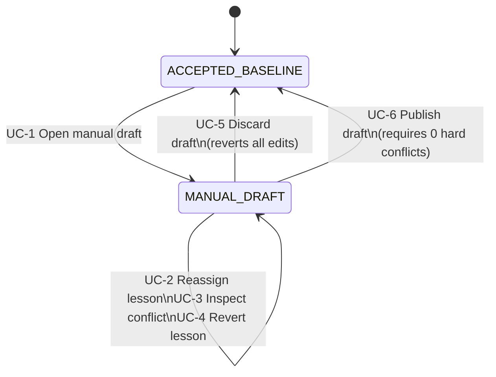

# Timetable Manual Editing

## Feature summary

Timetable Manual Editing provides an interactive operational workflow for school timetable administrators to make direct, manual adjustments to scheduled lessons within the timetable workspace. Administrators can select any scheduled lesson and reassign its period slot, room, or teacher.

Validation occurs automatically upon every change, evaluating hard scheduling constraints (teacher availability, teacher double-booking, room availability, room double-booking, class double-booking, and room policy compliance). When conflicts occur, the affected cells are highlighted on the timetable matrix and an explanatory overlay details the exact cause and the competing assignments involved. The workspace durably persists this working state—even with unresolved conflicts—allowing the administrator to iteratively work through and resolve conflicts over multiple steps or sessions. When all hard conflicts are resolved, the administrator can publish the working draft as the new authoritative accepted baseline.

## Scope and resolved decisions

### In scope

- Creation and management of a durable working draft (`MANUAL_DRAFT`) initialized from the current `ACCEPTED_BASELINE`.
- Direct manual reassignment of lesson assignment dimensions:
  - Weekly period slot (`periodId`).
  - Assigned room (`roomId`).
  - Assigned teacher (`teacherId`).
- Automatic real-time conflict validation against definition constraints:
  - Teacher unavailability.
  - Teacher double-booking (clash).
  - Room unavailability.
  - Room double-booking (clash).
  - Class/cohort double-booking (clash).
  - Room policy/compatibility violations.
- Visual presentation of conflict states:
  - Highlighting of all cells and lessons participating in any active conflict.
  - Interactive overlay/popover on conflicting cells explaining the root cause and listing competing lessons.
  - Total active conflict counter and publication readiness status badge.
- Durable persistence:
  - Automatic saving of the working draft including all manual overrides and detected conflicts.
  - Preservation of working draft state across page reloads and application restarts.
  - Independent retention of original accepted baseline assignments for comparison and revert.
- Revert and discard actions:
  - Individual lesson revert to restore its original accepted baseline assignment.
  - Complete draft discard restoring the unmodified accepted baseline upon explicit confirmation.
- Safe publication:
  - Promotion of a conflict-free draft to become the new `ACCEPTED_BASELINE`, verified via School Kernel verification.

### Resolved decisions

1. **Working Draft mode:** Manual adjustments do not mutate the accepted baseline directly. Changes are stored in a dedicated `MANUAL_DRAFT` workspace state. The prior accepted baseline remains unchanged until explicit publication.
2. **Conflict persistence:** The workspace durably persists draft timetables containing active hard conflicts so that multi-step manual conflict resolutions can span across sessions and restarts.
3. **Publication gate:** A manual editing draft cannot be published or accepted as a new baseline while any blocking hard conflicts remain. All clashes and unavailability conflicts must be resolved first.
4. **Per-lesson revert:** Each modified lesson in the draft retains a reference to its accepted baseline state, allowing the administrator to revert individual adjustments without discarding the whole draft.

## Actors and domain terms

### Actors

- **School timetable administrator:** The primary actor who selects lessons, reassigns slots, rooms, and teachers, inspects conflict details, and publishes or discards drafts.
- **Local durable storage:** Supporting system that durably persists workspace aggregate state, draft assignments, and baseline bundles.
- **School Kernel verifier:** Supporting system that performs authoritative contract and baseline constraint verification upon publication.

### Domain terms

- **Class (Cohort):** Administrator-facing name for a cohort of students following a scheduled timetable.
- **Lesson:** An individual scheduled session belonging to a class, with a subject, assigned teacher, assigned room, and scheduled period.
- **Slot (Period):** A recurring weekly timetable period (e.g., Monday period 1).
- **Accepted baseline:** The authoritative, verified `FEASIBLE` timetable and definition currently active for the school.
- **Manual draft (`MANUAL_DRAFT`):** A durable working workspace state containing in-progress assignment adjustments layered over the accepted baseline.
- **Conflict:** A hard constraint violation caused by one or more assignments (such as two lessons sharing a teacher in the same period).
- **Conflict overlay:** A user interface popover displaying the exact conflict code, explanation, and conflicting assignment details for a cell.

## Use-case map

| Use Case ID | Actor Goal | Primary Actor | Relations |
| --- | --- | --- | --- |
| UC-1 | Open manual editing draft | School timetable administrator | None |
| UC-2 | Reassign lesson slot, room, or teacher | School timetable administrator | Requires UC-1 (primary) |
| UC-3 | Inspect conflict details and explanation | School timetable administrator | Extends UC-2 at extension point 4a, Requires UC-1 |
| UC-4 | Revert individual lesson assignment | School timetable administrator | Requires UC-1 |
| UC-5 | Discard manual editing draft | School timetable administrator | Requires UC-1 |
| UC-6 | Publish manual editing draft as accepted baseline | School timetable administrator | Requires UC-1 |

## State models

The manual editing workflow governs transitions between `ACCEPTED_BASELINE` and `MANUAL_DRAFT`:

Allowed transitions:
- `ACCEPTED_BASELINE` -> `MANUAL_DRAFT` via UC-1.
- `MANUAL_DRAFT` -> `MANUAL_DRAFT` via UC-2, UC-3, UC-4.
- `MANUAL_DRAFT` -> `ACCEPTED_BASELINE` via UC-5 (discard).
- `MANUAL_DRAFT` -> `ACCEPTED_BASELINE` via UC-6 (publish).

All other transitions from or to `MANUAL_DRAFT` are refused without side effects.

---

## Detailed use cases

## UC-1 - Open manual editing draft

- Goal: Create an interactive working draft from the accepted baseline to begin manual timetable adjustments.
- Primary actor: School timetable administrator
- Supporting actors: Local durable storage
- Trigger: Administrator selects the action to start manual editing.
- Preconditions: Workspace is currently in `ACCEPTED_BASELINE`.
- Relations:
  - Requires: none
  - Includes: none
  - Extends: none

### Main success scenario

1. Administrator requests to begin manual editing of the accepted timetable.
2. System initializes a new working draft (`MANUAL_DRAFT`) with a copy of all current accepted assignments and empty manual adjustment records.
3. System durably saves the workspace in `MANUAL_DRAFT` state.
4. System presents the editable timetable workspace with lesson selection enabled, zero active conflicts, and a status indicator showing the draft is open.

### Extensions

- 1a. If the workspace is not in `ACCEPTED_BASELINE` (e.g. an active solver run or repair draft is already in progress), the system refuses the request with an explanatory message; end.
- 3a. If durable persistence fails, the system reports a storage error, retains the workspace in `ACCEPTED_BASELINE`, and creates no draft; end.

### Guarantees

- G1. Baseline immutability: the underlying accepted baseline definition and result remain byte-identical and unmodified.
- G2. Initial parity: upon creation, the draft assignments perfectly match the accepted baseline assignments.

### Postconditions

- Success: Workspace is in `MANUAL_DRAFT` state; administrator can select and modify any lesson.
- Minimal guarantee: Workspace remains in `ACCEPTED_BASELINE` without mutation if draft initialization fails.

---

## UC-2 - Reassign lesson slot, room, or teacher (primary)

- Goal: Select a specific scheduled lesson and change its period slot, room, or teacher, automatically validating conflicts and persisting the result.
- Primary actor: School timetable administrator
- Supporting actors: Local durable storage
- Trigger: Administrator selects a lesson and modifies its assignment values.
- Preconditions: Workspace is in `MANUAL_DRAFT`.
- Relations:
  - Requires: UC-1 (requires active manual draft)
  - Includes: none
  - Extends: none

### Main success scenario

1. Administrator selects a scheduled lesson on the timetable canvas.
2. System highlights the selected lesson, opens the assignment editor panel, and displays the lesson's current subject, class, period slot, room, and teacher, along with available options for each field.
3. Administrator selects a new period slot, room, or teacher for the lesson and confirms the reassignment.
4. System updates the lesson's working assignment in the draft.
5. System executes automatic conflict validation across all lessons against the school definition rules.
6. System detects zero hard conflicts.
7. System durably persists the updated draft state.
8. System updates the timetable canvas to render the lesson in its new position and marks the draft clean of conflicts.

### Extensions

- 6a. If the updated assignment causes one or more hard conflicts (e.g. teacher clash, teacher unavailability, room clash, room unavailability, or cohort clash):
  1. System identifies all conflicting lessons and records the corresponding conflict codes and explanatory descriptions from the Normative Data table.
  2. System persists the updated draft assignments along with the detected conflict metadata.
  3. System renders the timetable canvas with distinct visual conflict highlighting on all affected cells.
  4. System updates the conflict summary counter with the total number of active conflicts and disables baseline publication; continue with UC-3.
- 7a. If durable persistence of the draft update fails:
  1. System presents an observable persistence failure notice.
  2. System retains the in-memory changes in the browser for retry without corrupting stored state.
  3. System refuses baseline publication until persistence succeeds; end.

### Guarantees

- G1. Conflict persistence: working draft state containing active conflicts is durably saved, allowing the administrator to safely navigate away or reload without losing progress.
- G2. Comprehensive validation: every assignment change triggers complete re-evaluation of all hard constraints across the school definition.
- G3. Change tracking: modified lessons carry explicit tracking indicating which dimensions (period, room, teacher) differ from the accepted baseline.

### Postconditions

- Success: The draft contains the updated assignment and current validation state; canvas displays the updated position and conflict indicators.
- Minimal guarantee: Prior draft assignments remain unchanged if an edit is rejected or aborted.

---

## UC-3 - Inspect conflict details and explanation

- Goal: View detailed conflict explanations and root-cause information for any highlighted conflicting cell.
- Primary actor: School timetable administrator
- Supporting actors: none
- Trigger: Administrator selects, hovers over, or activates the conflict indicator on a conflicting cell.
- Preconditions: Workspace is in `MANUAL_DRAFT` and at least one lesson has an active conflict.
- Relations:
  - Requires: UC-1
  - Includes: none
  - Extends: UC-2 at extension point 6a

### Main success scenario

1. Administrator activates the conflict indicator or selects a conflicting cell on the timetable matrix.
2. System presents an explanatory overlay directly adjacent to the cell.
3. System displays the exact conflict description, including the conflict type, the contested resource (teacher, room, or cohort), and the identity and details of the competing lesson(s) sharing that resource and period.
4. Administrator reviews the explanation to determine the necessary follow-up adjustment.

### Extensions

- 2a. If the cell is involved in multiple distinct conflicts simultaneously (e.g., both teacher clash and room clash):
  1. System lists each distinct conflict as an itemized entry in the overlay, with individual explanation and competing lesson details; resume at step 4.

### Guarantees

- G1. Complete causal explanation: every conflict overlay explains both what resource is in conflict and which specific assignments cause the violation.
- G2. Non-mutating inspection: viewing conflict details does not alter draft state, assignments, or validation status.

### Postconditions

- Success: Explanatory overlay is displayed with clear, actionable conflict rationale.
- Minimal guarantee: Timetable canvas and draft state remain unchanged.

---

## UC-4 - Revert individual lesson assignment

- Goal: Revert a manually adjusted lesson back to its original assignment in the accepted baseline.
- Primary actor: School timetable administrator
- Supporting actors: Local durable storage
- Trigger: Administrator requests to revert an edited lesson.
- Preconditions: Workspace is in `MANUAL_DRAFT` and the selected lesson has modifications differing from the accepted baseline.
- Relations:
  - Requires: UC-1
  - Includes: none
  - Extends: none

### Main success scenario

1. Administrator selects a modified lesson and activates the revert-to-baseline action.
2. System restores the lesson's period slot, room, and teacher to match its original assignment in the accepted baseline.
3. System re-evaluates automatic conflict validation across all lessons.
4. System durably persists the updated draft.
5. System updates the timetable canvas, clearing modifications on the reverted lesson and removing any conflict highlights that were resolved by the revert.

### Extensions

- 1a. If the selected lesson has no modifications differing from the accepted baseline, the revert action is disabled; end.
- 4a. If durable persistence fails, the system reports a storage error and retains the uncommitted state in memory for retry; end.

### Guarantees

- G1. Baseline fidelity: reverting restores the exact values recorded in the accepted baseline for all three dimensions (period, room, teacher).
- G2. Automatic conflict recalculation: clearing an edit immediately resolves any conflicts solely caused by that edit.

### Postconditions

- Success: Selected lesson assignment matches accepted baseline; draft is persisted; conflict indicators update accordingly.
- Minimal guarantee: Prior draft state remains unchanged if revert cannot be applied.

---

## UC-5 - Discard manual editing draft

- Goal: Discard the working draft and all manual edits, returning the workspace to the untouched accepted baseline.
- Primary actor: School timetable administrator
- Supporting actors: Local durable storage
- Trigger: Administrator requests to discard the manual editing draft.
- Preconditions: Workspace is in `MANUAL_DRAFT`.
- Relations:
  - Requires: UC-1
  - Includes: none
  - Extends: none

### Main success scenario

1. Administrator requests to discard the manual editing draft.
2. System displays a confirmation dialog warning that all unaccepted manual edits will be permanently discarded.
3. Administrator confirms the discard.
4. System deletes the manual draft from durable storage.
5. System transitions the workspace state to `ACCEPTED_BASELINE`.
6. System renders the accepted baseline timetable, with zero unaccepted modifications and zero draft conflicts.

### Extensions

- 3a. If administrator cancels the confirmation dialog:
  1. System closes the dialog without side effects.
  2. Workspace remains in `MANUAL_DRAFT` with all edits preserved; end.
- 4a. If draft deletion fails in durable storage:
  1. System reports a storage error.
  2. Workspace remains in `MANUAL_DRAFT` with edits preserved; end.

### Guarantees

- G1. Clean discard: discarding completely purges manual draft records, leaving no orphaned adjustments.
- G2. Confirmation barrier: discard always requires explicit positive confirmation before destructive removal.

### Postconditions

- Success: Workspace is in `ACCEPTED_BASELINE`; all unaccepted manual adjustments are discarded.
- Minimal guarantee: Workspace remains in `MANUAL_DRAFT` if discard is cancelled or fails.

---

## UC-6 - Publish manual editing draft as accepted baseline

- Goal: Atomically advance the validated, conflict-free manual editing draft to become the new official accepted baseline.
- Primary actor: School timetable administrator
- Supporting actors: Local durable storage, School Kernel verifier
- Trigger: Administrator requests to publish the manual editing draft.
- Preconditions: Workspace is in `MANUAL_DRAFT`.
- Relations:
  - Requires: UC-1
  - Includes: none
  - Extends: none

### Main success scenario

1. Administrator requests to publish the manual editing draft as the new accepted baseline.
2. System verifies that the draft contains zero active hard conflicts.
3. System invokes the School Kernel verifier against the candidate timetable and definition.
4. The School Kernel verifier confirms the timetable is feasible and valid.
5. System atomically persists the new accepted baseline bundle, increments the baseline version, generates a new timetable revision hash, and deletes the manual draft.
6. System transitions workspace state to `ACCEPTED_BASELINE`.
7. System renders the updated accepted timetable and announces successful publication.

### Extensions

- 2a. If the draft contains one or more unresolved hard conflicts:
  1. System refuses publication.
  2. System displays an observable warning explaining that all hard conflicts must be resolved before publishing, indicating the number of remaining conflicts.
  3. Workspace remains in `MANUAL_DRAFT` without mutating the existing accepted baseline; end.
- 4a. If School Kernel verification detects any rule or contract violation:
  1. System refuses publication.
  2. System displays the verification error report.
  3. Workspace remains in `MANUAL_DRAFT` without mutating the existing accepted baseline; end.
- 5a. If atomic persistence of the new baseline bundle fails:
  1. System preserves the existing accepted baseline unchanged.
  2. System keeps the manual draft intact in `MANUAL_DRAFT` for retry.
  3. System reports the storage failure; end.

### Guarantees

- G1. Baseline integrity: an accepted baseline is never created from a timetable with hard conflicts or verification errors.
- G2. Atomic progression: publication either completely advances the accepted baseline and closes the draft, or leaves the existing baseline untouched.
- G3. Lineage fidelity: the new accepted baseline bundle records the previous baseline revision as its parent lineage.

### Postconditions

- Success: Workspace is in `ACCEPTED_BASELINE` with updated version and assignments; manual draft is closed and cleaned up.
- Minimal guarantee: Existing `ACCEPTED_BASELINE` remains intact and `MANUAL_DRAFT` remains preserved if publication fails or is refused.

---

## Normative data

The system evaluates and reports exactly these conflict codes and definitions:

| Conflict Code | Conflict Type | Trigger Condition | Visual Presentation |
| --- | --- | --- | --- |
| `TEACHER_UNAVAILABLE` | Teacher Unavailable | Assigned lesson is placed in a period declared unavailable for that teacher | Conflicting cell highlight, warning badge, overlay explaining teacher unavailability |
| `TEACHER_CLASH` | Teacher Double-Booked | Two or more lessons are assigned to the same teacher in the same period | Conflicting cell highlight, warning badge, overlay identifying competing lesson(s) |
| `ROOM_UNAVAILABLE` | Room Unavailable | Assigned lesson is placed in a period declared unavailable for that room | Conflicting cell highlight, warning badge, overlay explaining room unavailability |
| `ROOM_CLASH` | Room Double-Booked | Two or more lessons are assigned to the same room in the same period | Conflicting cell highlight, warning badge, overlay identifying competing lesson(s) |
| `COHORT_CLASH` | Class Double-Booked | Two or more lessons are assigned to the same class/cohort in the same period | Conflicting cell highlight, warning badge, overlay identifying competing lesson(s) |
| `ROOM_INCOMPATIBLE` | Room Policy Violation | Assigned room does not satisfy the lesson's subject or room assignment requirements | Conflicting cell highlight, warning badge, overlay explaining room capability mismatch |

*exactly these rows - no more, no fewer*

---

## Out of scope

- Automated re-solving or solver optimization during manual editing (handled by repair solver features).
- Concurrent multi-administrator editing or user account permissions.
- Editing school definition elements (adding/removing teachers, rooms, classes, or subject requirements) within manual editing.
- Split-group partitioning or sub-cohort assignment mutation.
- Mobile phone editing interfaces.

---

## External dependencies

None. All validation rules and storage mechanisms are local to the School Kernel and Timetable Workspace applications.
