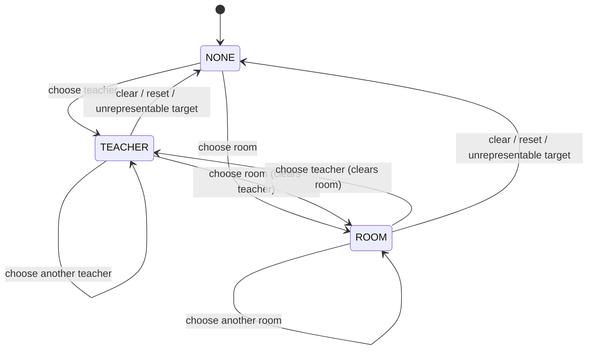

# Timetable Matrix Lenses Specification

## Feature summary

This feature changes the Teacher and Room filters of the whole-school Week/Day matrix into lenses. A lens replaces the
class row groups with one row group for the selected teacher or room. The grid shape, lesson tiles, inspector,
highlights, conflict overlays, and lifecycle controls stay in place. Tiles in a lens name the subject, the class, and
the other resource.

The feature supersedes the focused class, teacher, and room schedule surface. It changes presentation only. The
accepted definition, accepted result, repair draft, repair proposal, manual draft, and workspace lifecycle remain
authoritative and are not changed by any lens behavior.

## Scope and resolved decisions

### In scope

- Teacher lens and room lens on the Week and Day matrices, in every lifecycle mode that renders the whole-school matrix.
- Lens-specific tile content and lens-specific row headers.
- Availability-aware empty cells in a lens.
- Lens entry from the Filters disclosure, from the inspector, and from teacher investigation "Show only matches".
- Lens-aware filter status, counts, and active-criteria summary.
- Lens behavior during lesson selection, manual edits, conflict inspection, and repair review targets.
- A narrow-screen read-only Day matrix, narrowed to one class or one lens, that replaces the focused agenda.
- Removal of the focused schedule surface and its entry and return controls.

### Resolved decisions

1. **Auto-pivot, single selection.** A teacher or room filter value makes that entity the only row group.
2. **One lens at a time.** Selecting a teacher lens clears any room lens, and the reverse.
3. **Tile content by lens** follows the Normative data table exactly.
4. **Class filter is not a lens.** It narrows class row groups as today and intersects with an active lens.
5. **Teacher investigation filter mode applies the teacher lens.** Checking "Show only matches" under teacher
   investigation applies the teacher lens for the investigated teacher. Unchecking it clears that lens. Subject
   investigation is unchanged.
6. **Edits do not move the lens.** A lesson reassigned out of the active lens leaves the rendered lens. It stays selected
   in the inspector, and the workspace announces the departure.
7. **The lens is ephemeral presentation state.** It resets on reload. Only range and weekday are stored locally, as
   today.
8. **Focused schedules are removed** on desktop and narrow viewports.

## Actors and domain terms

### Actors

- **School timetable administrator:** applies, changes, and clears lenses; inspects and edits lessons within them.
- **Local presentation preference store:** retains only range and weekday per school and device. It never stores a
  lens.

### Domain terms

- **Class rows:** the default matrix arrangement. There is one row group per declared class, in definition order.
- **Lens:** an explicit filter that replaces class rows with one row group for a single teacher (**teacher lens**) or a
  single room (**room lens**). The row group represents every assignment of that entity in the selected range, after
  intersecting other active filters.
- **Lens row group:** the one row group rendered under a lens. In Week, it holds one row per period order with
  weekdays as columns. In Day, it is one row with the selected weekday's periods as columns.
- **Lens cell:** the intersection of the lens entity and one period. It may hold zero, one, or several tiles.
- **Unavailable cell:** an empty lens cell whose period is absent from the entity's declared `availablePeriodIds`.
- **Represented population:** as in `timetable-inspection-ux`: every assignment included after explicit filters,
  including content outside the viewport. The lens is one of those filters.

## Use-case map

| Use Case ID | Actor Goal | Primary Actor | Relations |
| --- | --- | --- | --- |
| UC-1 | See one teacher's or room's schedule in the matrix | School timetable administrator | Primary; none |
| UC-2 | Change or clear the lens | School timetable administrator | Requires UC-1 |
| UC-3 | Inspect and edit lessons within a lens | School timetable administrator | Requires UC-1; extends UC-1 at 5a |
| UC-4 | Read a lens on a narrow screen | School timetable administrator | Extends UC-1 at 1a |

## Presentation state model

The lens is a new value of the existing filter dimension. It never changes a workspace lifecycle state.

| Dimension | Values | Initial or reload value | Allowed transition |
| --- | --- | --- | --- |
| Lens | `NONE`, `TEACHER(id)`, `ROOM(id)` | `NONE` on desktop. On narrow screens, see UC-4 | Administrator selects or clears a Teacher or Room filter, uses an inspector "Show week" action, or toggles teacher investigation "Show only matches". The workspace clears it for an unrepresentable review target |

Rules:

1. Entering, changing, or clearing a lens retains range, weekday, search, subject and teacher highlights, class and
   period filters, and the selected lesson when it is still represented.
2. Clearing the lens restores class rows and the matrix scroll position recorded when the lens was entered, if the
   range is still the same. If the range changed between Week and Day, class rows start at the top. If the selected
   lesson is represented, it is scrolled into view instead of either position. Changing the weekday within Day does
   not change the range.
3. Filter reset clears the lens along with the other narrowing criteria.
4. A lens whose entity is not declared in the displayed definition is refused, and the lens stays `NONE`.
5. Reload returns the lens to `NONE`.

## UC-1 - See one teacher's or room's schedule in the matrix (primary)

- Goal: Read the complete recurring schedule of one teacher or room in the same matrix used for the whole school.
- Primary actor: School timetable administrator
- Supporting actors: none
- Trigger: The administrator chooses a teacher or room in the Filters disclosure, activates "Show week" for a teacher
  or room in the inspector, or checks "Show only matches" under teacher investigation.
- Preconditions: The workspace renders the whole-school matrix in any lifecycle mode.
- Relations:
  - Requires: none
  - Includes: none
  - Extends: none

### Main success scenario

1. The administrator chooses a teacher or a room.
2. The system clears any lens of the other type, then applies the chosen lens.
3. The system renders the current range (Week or Day) with one lens row group. The row header shows the entity's
   display name and its lens type.
4. The system renders each assignment of that entity, after other active filters, in its period cell. Tile content
   follows the Normative data table. Empty cells outside declared availability are marked unavailable.
5. The system labels the result as narrowed. The active-criteria summary shows the lens as a removable criterion, and
   the counts report the lens entity and the unique represented lessons.
6. The administrator reads the schedule.

### Extensions

- 1a. If the viewport is 700 CSS px or narrower, continue with UC-4.
- 4a. If the entity has no represented assignment, the system renders the full empty lens row group, identifies the
  entity, reports zero lessons, and offers reset. It never invents an assignment; resume at step 6.
- 4b. If several assignments share the lens cell, the system renders every one of them as a separate tile in that cell.
  In a manual draft, tiles that participate in a conflict carry the existing conflict highlight and indicator; resume
  at step 5.
- 4c. If the entity declares no `availablePeriodIds`, empty cells are rendered as ordinary empty cells, with no
  availability claim; resume at step 5.
- 5a. If the administrator selects a tile, continue with UC-3.

### Guarantees

- G1. Same surface: applying a lens never navigates away, replaces the matrix component, or closes the inspector.
- G2. Completeness: the lens row group represents every assignment of the entity in the selected range that satisfies
  the other active filters. This holds regardless of scroll position.
- G3. Honesty: a lens view is always labelled as narrowed and names its entity. Emptiness is never called
  availability unless availability is declared.
- G4. Non-mutation: applying a lens changes no accepted, draft, proposal, or policy state.

### Postconditions

- Success: The matrix shows exactly one lens row group for the chosen entity, with lens-specific tiles.
- Minimal guarantee: If the lens cannot be applied, the matrix keeps its prior rows and filters unchanged.

---

## UC-2 - Change or clear the lens

- Goal: Move between entities, or back to the whole school, without losing investigative context.
- Primary actor: School timetable administrator
- Supporting actors: none
- Trigger: The administrator chooses a different entity, chooses the other lens type, removes the lens criterion,
  chooses "All teachers" or "All rooms", or resets filters.
- Preconditions: A lens is active.
- Relations:
  - Requires: UC-1
  - Includes: none
  - Extends: none

### Main success scenario

1. The administrator removes the lens criterion or chooses "All teachers" or "All rooms".
2. The system restores class rows under the remaining active filters.
3. The system retains range, weekday, search, highlights, class and period filters, and the selected lesson.
4. The system restores the scroll position recorded at lens entry when the range is unchanged. After a Week/Day range
   change, class rows start at the top. If a selected lesson is represented, the system brings it into view instead.
5. The system updates the filter status to complete or narrowed, according to the remaining criteria.

### Extensions

- 1a. If the administrator chooses a different teacher or room of the same type, the system replaces the lens entity,
  keeps the selection only when the selected lesson belongs to the new entity, and renders UC-1 steps 3–5; end.
- 1b. If the administrator chooses the other lens type, the system clears the current lens, applies the new one, and
  renders UC-1 steps 3–5; end.
- 1c. If the administrator resets filters, the system clears the lens and every other narrowing criterion according to
  `timetable-inspection-ux` rule 7; resume at step 4.
- 3a. If the selected lesson is not represented after the change, the system clears the selection and announces
  why; resume at step 4.

### Guarantees

- G1. Context retention: only the lens changes, and every other presentation dimension is retained.
- G2. No surface change: changing or clearing a lens never renders a separate surface or a "return" control.

### Postconditions

- Success: The matrix shows the new lens or class rows, with the retained context.
- Minimal guarantee: Presentation state stays self-consistent. Authoritative data is untouched.

---

## UC-3 - Inspect and edit lessons within a lens

- Goal: Select, inspect, edit, and review lessons from a lens with the same behavior as class rows.
- Primary actor: School timetable administrator
- Supporting actors: Local durable storage (manual draft persistence, unchanged)
- Trigger: The administrator selects a tile in a lens row group, or a review target is chosen while a lens is active.
- Preconditions: A lens is active.
- Relations:
  - Requires: UC-1
  - Includes: none
  - Extends: UC-1 at 5a

### Main success scenario

1. The administrator selects a tile in the lens row group.
2. The system opens the inspector with the lesson's complete details. It offers "Show week" actions for the lesson's
   teacher, room, and class.
3. In `MANUAL_DRAFT`, the administrator changes the lesson's period, room, or teacher through the existing editor.
4. The system applies the edit, validates, persists, and re-renders exactly as `timetable-manual-editing` UC-2 does.
5. The lesson is still represented by the lens, so the system renders it in its new lens cell with its selection
   retained.

### Extensions

- 1a. If a repair review target, diagnostic link, or conflict overlay link selects a lesson that the lens does not
  represent, the system clears the lens (and any other excluding filter) with an announcement that names the cleared
  criteria. It then selects the target, as it does for filters today; end.
- 2a. If the administrator activates a teacher or room "Show week" action, continue with UC-2 extension 1a or 1b. If
  they activate a class "Show week" action, the system clears the lens, applies the class filter for that class, and
  keeps the lesson selected; end.
- 5a. If the edit reassigns the lesson to a different teacher or room than the lens entity:
  1. The system removes the lesson's tile from the lens row group.
  2. The system keeps the lesson selected and its details open in the inspector.
  3. The system announces that the lesson left the current lens and names its new teacher or room.
  4. The lens does not change; end.
- 5b. If the edit causes a conflict involving another lesson of the lens entity, both tiles appear in the same lens cell
  with conflict highlights, and the conflict overlay behaves as in `timetable-manual-editing` UC-3; end.

### Guarantees

- G1. Parity: selection, inspector, editing, conflict indicators, conflict overlays, and comparison cues behave in a
  lens exactly as on class rows.
- G2. No silent disappearance: a selected lesson that leaves the lens stays inspectable and is announced.
- G3. Non-mutation by presentation: applying, changing, or clearing a lens never issues a workspace mutation.

### Postconditions

- Success: The administrator completes inspection or editing without leaving the matrix.
- Minimal guarantee: Manual-draft persistence and failure semantics are exactly those of `timetable-manual-editing`.

---

## UC-4 - Read a lens on a narrow screen

- Goal: Read one class's, teacher's, or room's day on a phone-width viewport.
- Primary actor: School timetable administrator
- Supporting actors: Local presentation preference store
- Trigger: The workspace renders at 700 CSS px or narrower.
- Preconditions: The workspace has a timetable to display.
- Relations:
  - Requires: none
  - Includes: none
  - Extends: UC-1 at 1a

### Main success scenario

1. The system renders the Day matrix for the last valid weekday. It narrows the matrix to the first class in
   definition order, unless a lens or class filter is already active.
2. The system shows the narrow notice, identifies the lifecycle, and withholds editing, run cancellation, and
   proposal decisions.
3. The administrator chooses a class, teacher, or room from the narrow picker, and chooses the weekday.
4. The system renders the Day matrix for that one row group, using the Normative tile content. Horizontal scroll is
   allowed within the matrix.

### Extensions

- 3a. If the chosen entity has no lesson on the chosen weekday, the system renders the empty row with availability
  marks where declared; resume at step 3.

### Guarantees

- G1. The narrow view uses the Day matrix renderer. No agenda list or separate renderer remains.
- G2. The narrow view never claims to be the desktop workbench and exposes no mutation.
- G3. The desktop range preference is not overwritten by the narrow view.

### Postconditions

- Success: One row group's day is readable at 390 CSS px width.
- Minimal guarantee: No workspace data or desktop preference changes.

---

## Normative data

### Tile content by arrangement and range

| Arrangement | Row header | Week tile (visible) | Day tile (visible) | Accessible name adds |
| --- | --- | --- | --- | --- |
| Class rows | Class display name | Subject · room | Subject · teacher · room | Teacher (Week), class, weekday, period, lesson ID, cues |
| Teacher lens | "Teacher" · teacher display name | Subject · room · class | Subject · room · class | Teacher, weekday, period, lesson ID, cues |
| Room lens | "Room" · room display name | Subject · teacher · class | Subject · teacher · class | Room, weekday, period, lesson ID, cues |

*exactly these rows - no more, no fewer*

Class labels use the class display name, clamped under the existing tile clamping rules and complete in accessible
text and the inspector.

### Empty lens cells

| Entity declares `availablePeriodIds` | Period in set | Cell rendering |
| --- | --- | --- |
| Yes | Yes | Ordinary empty cell |
| Yes | No | Unavailable cell, with a text cue and not color alone |
| No | — | Ordinary empty cell, with no availability claim |

*exactly these rows - no more, no fewer*

### Removed elements

| Element | Current location | Replacement |
| --- | --- | --- |
| Focused schedule surface | `focused-renderer.js`, `renderFocused()` | Lens row group on the Week/Day matrix |
| "Focused schedules" entry buttons (Class, Teacher, Room) | `focusedEntry()` under the matrix | Inspector "Show week" actions and the Filters disclosure |
| "Return to whole school" button | Focused surface header | Removing the lens criterion (UC-2) |
| Focused type tabs and entity picker | Focused surface toolbar | Teacher and Room filter selects; narrow picker (UC-4) |
| `openFocused`, `changeFocusedType`, `returnToWholeSchool`, `focusedType`, `focusedId`, `scrollContext` | `inspection-state.js` | A lens value on the filter dimension, plus lens-entry scroll context |

*exactly these rows - no more, no fewer*

### Superseded clauses

| Source | Clause | Superseded by |
| --- | --- | --- |
| `timetable-inspection-ux` | Scope: "focused class, teacher, and room schedules remain available" | This feature's scope |
| `timetable-inspection-ux` | Domain term "Focused schedule"; state dimension "Surface" | Domain term "Lens"; state dimension "Lens" |
| `timetable-inspection-ux` | UC-3 steps 4–7, extensions 4a and 4b, and G4, G5, G8 (focused parts) | UC-1, UC-2, UC-4 |
| `timetable-inspection-ux` | Teacher investigation "Show only matches" as a class-row filter | Resolved decision 5 |
| `timetable-workbench-layout` | Focused drill-down, focused return, and narrow "focused agenda" clauses | UC-2, UC-4 |

*exactly these rows - no more, no fewer*

---

## Out of scope

- Multi-entity lenses or an all-teachers or all-rooms row arrangement.
- A lens for subjects or periods. Subject investigation and the period filter are unchanged.
- Changes to conflict codes, validation, persistence, publication, or repair semantics.
- Searchable entity pickers, keyboard shortcuts for lens switching, and previous/next entity stepping.
- Print or export of a lens.

---

## External dependencies

None. All data comes from the displayed definition and timetable already loaded by the workspace.
